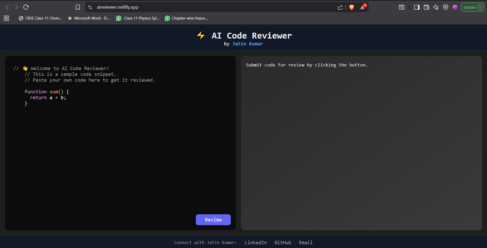
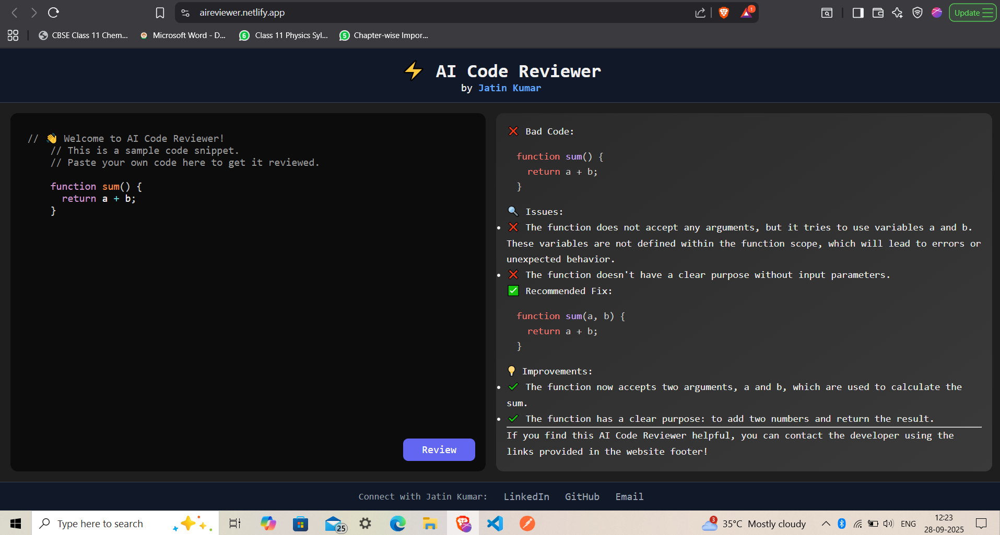

# AI Code Reviewer

[](https://aireviewer.netlify.app)
[](https://ai-code-reviewer-1-y6gy.onrender.com)

**AI Code Reviewer** is a full-stack web app that leverages AI to analyze and review code, giving instant feedback on quality, readability, performance, and best practices.

🎯 **Live Demo:** [https://aireviewer.netlify.app](https://aireviewer.netlify.app)  
⚡ **Backend API:** [https://ai-code-reviewer-1-y6gy.onrender.com](https://ai-code-reviewer-1-y6gy.onrender.com)

---

## Features

- AI-powered code review with constructive feedback  
- Sample code in editor guides first-time users  
- Clean, responsive UI with scrollable editor and review panel  
- Footer links for contacting the developer  

---

## Tech Stack

- **Frontend:** React, JavaScript, CSS, Axios, PrismJS  
- **Backend:** Node.js, Express, Google Gemini API (or OpenAI)  
- **Hosting:** Netlify (frontend), Render (backend)

---

## Project Structure


```
.
├── frontend/     # React app
├── backend/      # Node.js + Express API
├── screenshots/  # Images of the app
└── README.md
```


---

## Quick Start

1. Clone the repo:


git clone https://github.com/Jatin3979/AI_Code_Reviewer.git
cd AI_Code_Reviewer


2. Install dependencies:


cd frontend
npm install

cd ../backend
npm install


3. Configure `.env` files with API keys (e.g., `GOOGLE_API_KEY`) and backend port.

4. Run locally:


# Backend
cd backend
npm start

# Frontend (new terminal)
cd frontend
npm start


5. Open `http://localhost:3000` and test the app.

---

## Screenshots


*Clean, intuitive UI with a scrollable code editor and review panel.*


*Detailed AI feedback highlighting issues, improvements, and best practices.*

---

## Contributing

Contributions welcome!

* Open issues for bugs or feature requests
* Submit pull requests with improvements
* Follow coding best practices and document your changes

---


**Made with ❤️ by Jatin Kumar**
GitHub: [https://github.com/Jatin3979](https://github.com/Jatin3979)
LinkedIn: [https://www.linkedin.com/in/jatin-kumar-1560152a7/](https://www.linkedin.com/in/jatin-kumar-1560152a7/)


